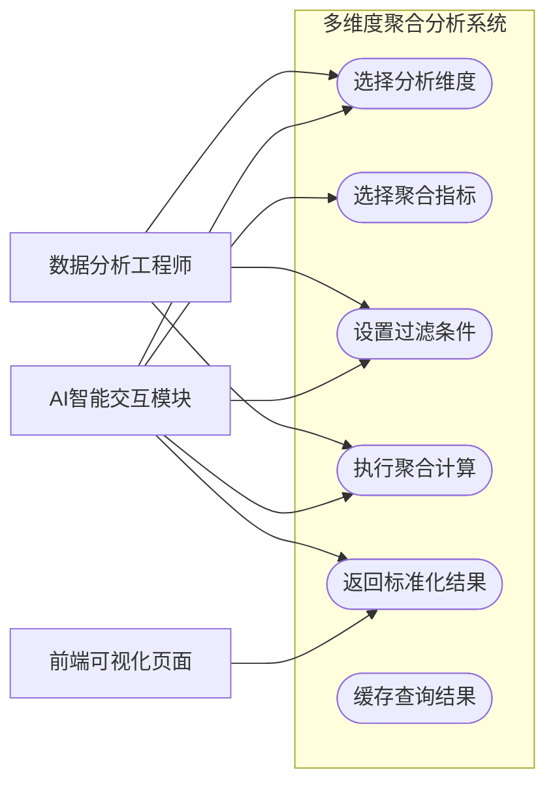
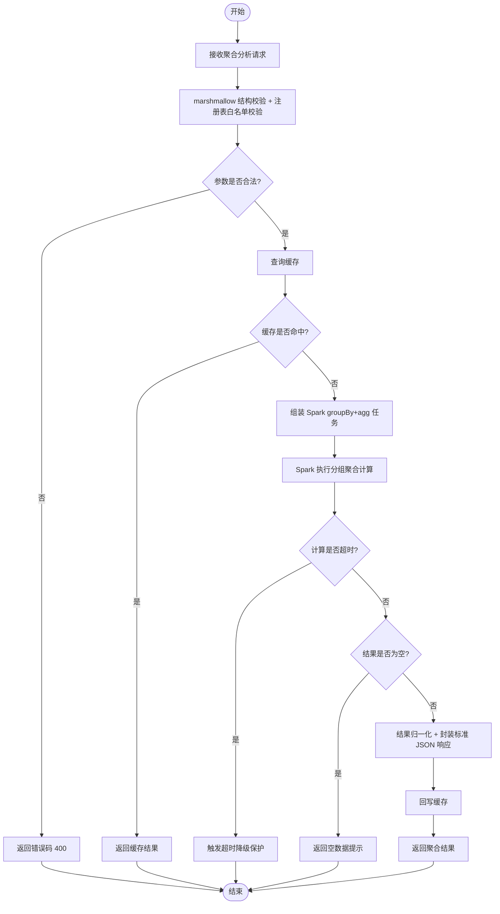
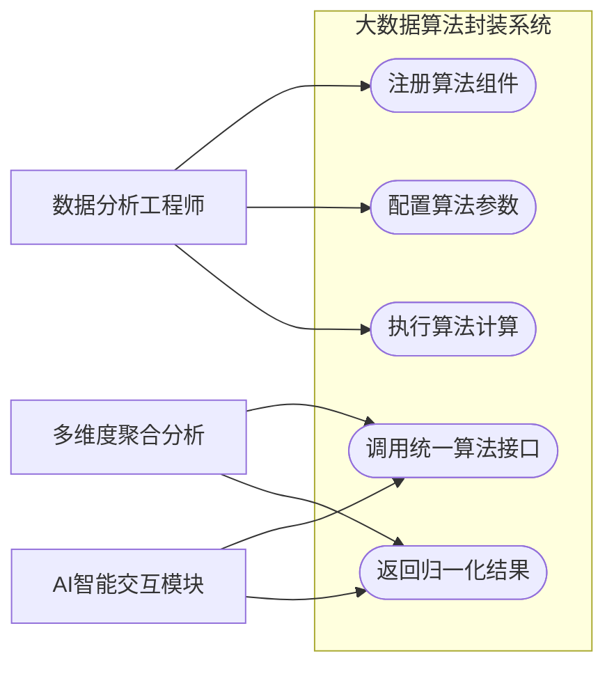
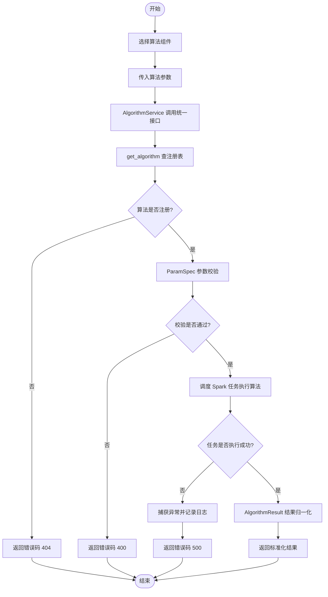
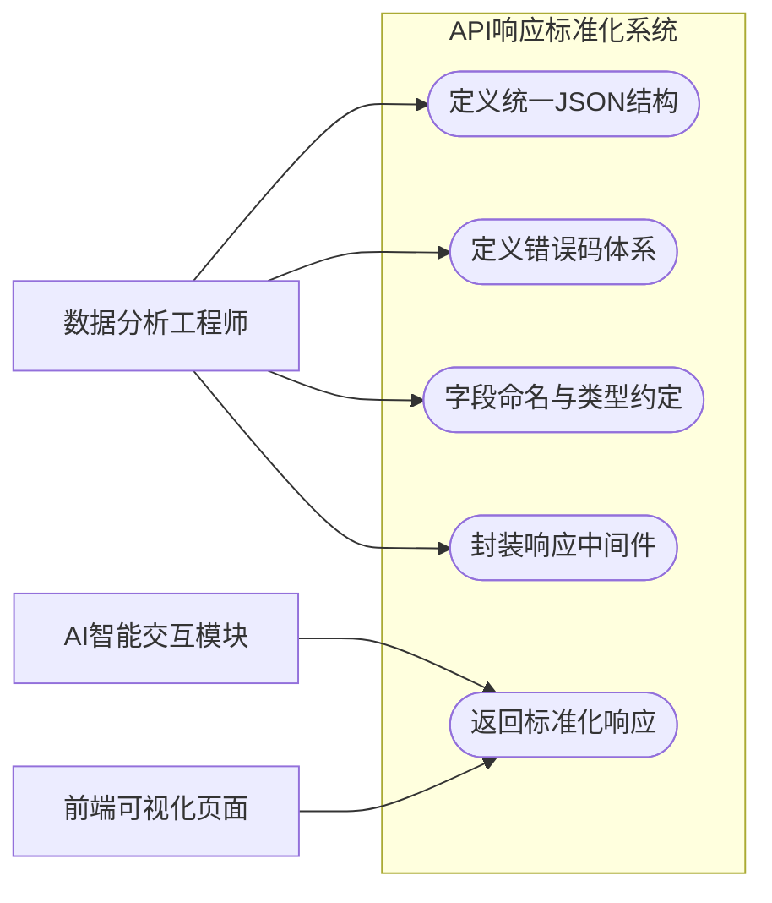
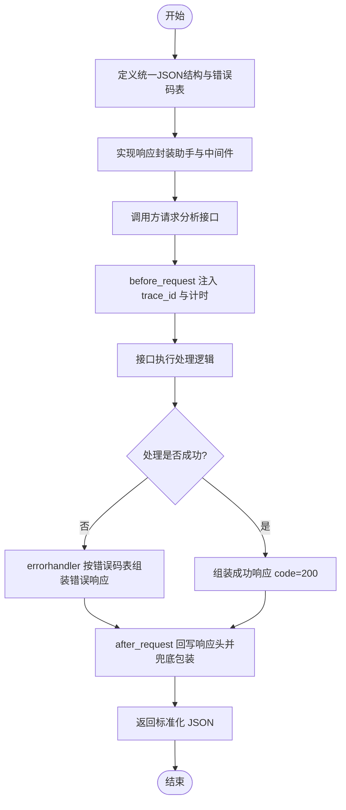
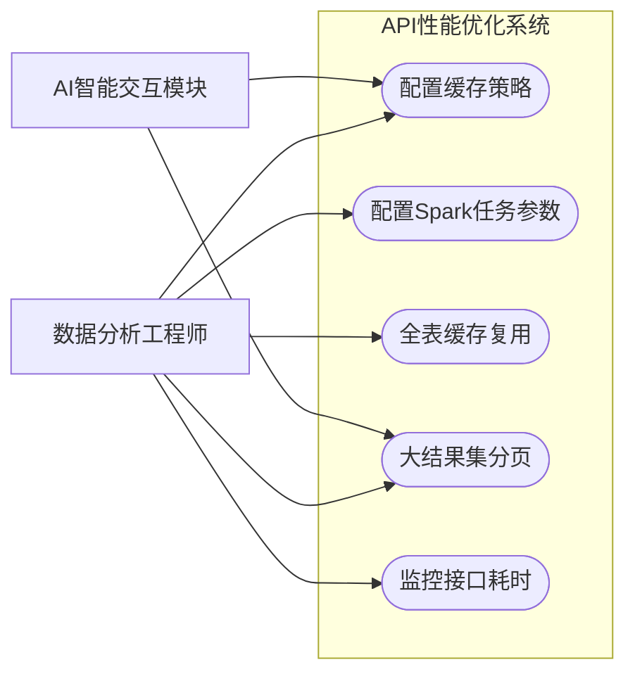
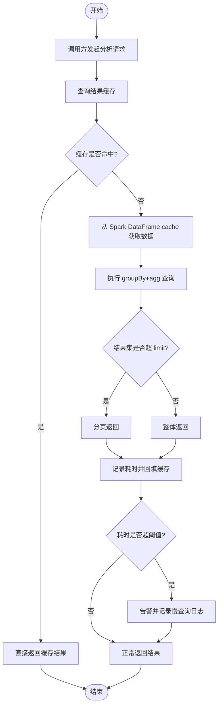
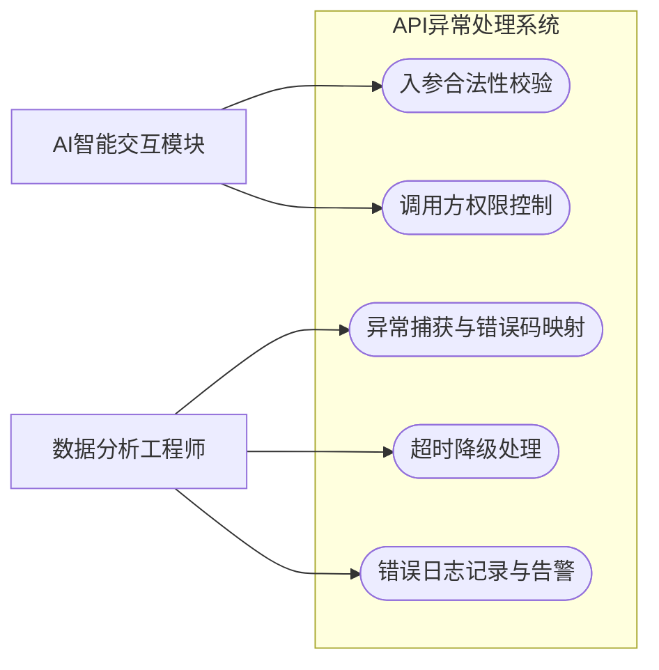
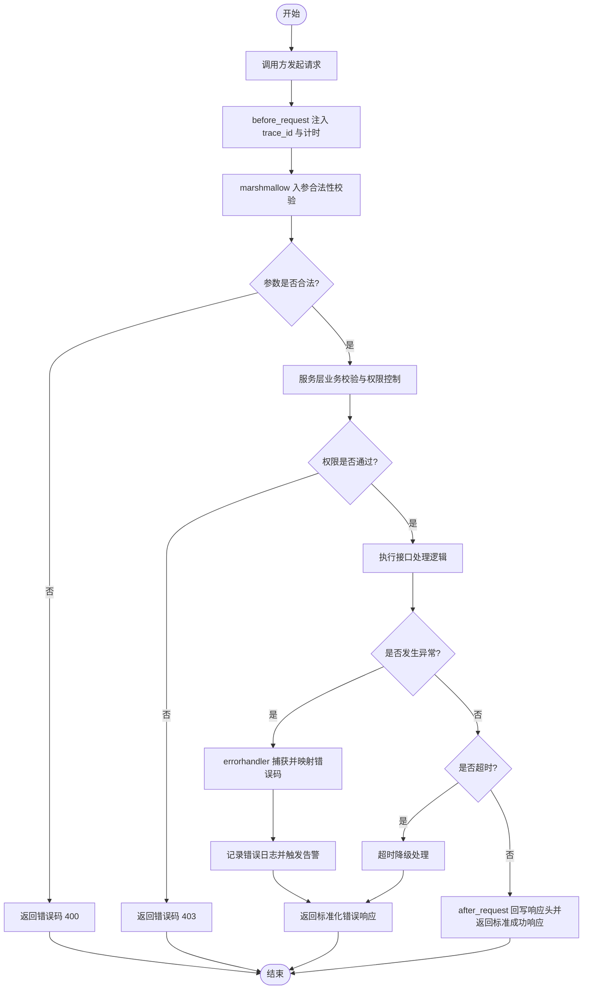

# 智慧医疗大数据与AI大模型分析平台 —— 软件需求规约（人员3 功能设计）

> 编写人：人员3（系统设计工程师 / 后端工程师 / 数据分析工程师）
> 负责模块：大数据分析服务模块（服务层）
> 依据：《第1组_软件需求规约》模板格式（功能简单介绍 / 用例图 / 用例阐述 / 流程图）
> 数据基础：SPARCS 2021 住院患者出院数据集（200万+ 条、33 个字段）

---

## 3.3 大数据分析服务模块（人员3）

**总述**：大数据分析服务模块基于数据预处理与持久化模块产出的结构化清洗后 CSV（`processed/*_clean.csv`），通过 Spark 加载并缓存全表（`SparkDataProvider`），提供多维度聚合分析、大数据算法封装、API 响应标准化三项一期核心能力，并在二期完成 API 性能优化与 API 异常处理机制建设。模块以 Flask 为核心，开发 RESTful API，封装医疗数据多维度聚合分析与复杂数据挖掘逻辑，统一响应格式，支撑 AI 智能交互模块（LangChain Agent）的自然语言调用与前端大屏可视化展示。

> 一期实现采用「清洗后 CSV + Spark 缓存」的轻量化数据底座，对应需求 3.3.x 中的「MySQL + HDFS」表述在仓库中以「Spark + 内存缓存」落地；二期接入 MySQL/HDFS 后仅需扩展 `DataProvider` 子类，业务代码无需改动。

**功能清单**：

| 期次 | 编号 | 功能名称 | 仓库实现位置 |
|---|---|---|---|
| 一期 | 3.3.1 | 多维度聚合分析 | `app/api/v1/aggregation.py` + `app/services/aggregation_service.py` + `config/registry.py` |
| 一期 | 3.3.2 | 大数据算法封装 | `app/algorithms/base.py` + `app/algorithms/{group_aggregation,statistics,association,cost_prediction,readmission_risk}.py` + `app/api/v1/algorithms.py` + `app/services/algorithm_service.py` |
| 一期 | 3.3.3 | API响应标准化 | `app/core/response.py` + `app/core/error_codes.py` + `app/core/exceptions.py` + `app/core/middleware.py` |
| 二期 | 3.3.4 | API性能优化 | `app/core/cache.py`（一期进程内 TTL+LRU，二期可切换 Redis，接口不变） |
| 二期 | 3.3.5 | API异常处理机制 | `app/core/middleware.py`（统一异常处理） + `app/core/exceptions.py`（业务异常体系） |

---

## 3.3.1 多维度聚合分析

### 功能简单介绍

多维度聚合分析是大数据分析服务模块的核心功能。系统基于预处理后产出的结构化医疗大数据（源自 SPARCS 2021 住院患者出院数据集，数据量 200 万+ 条，含 33 个字段），支持按**疾病类型（CCSR Diagnosis Description）、年龄组（Age Group）、医院（Facility Name / Hospital County）、出院年份（Discharge Year）、性别（Gender）、支付方式（Payment Typology 1/2/3）**等 22 个已注册维度，对**住院人次（COUNT）、平均住院时长（AVG Length of Stay）、平均总费用（AVG Total Charges）、平均总成本（AVG Total Costs）**等 9 个已注册指标进行单维或多维组合的聚合统计。

系统通过 Spark DataFrame 完成大规模数据的分布式分组聚合计算（`groupBy + agg`），结果按统一规范归一化（数值精度、NaN→null、字段命名统一）后封装为标准 JSON 并通过 RESTful API 对外提供，支撑 AI 智能交互模块的自然语言查询与前端 ECharts 可视化展示，为医疗资源优化、疾病趋势预测和医疗成本控制提供数据支撑。

> 维度/指标全部走 `config/registry.py` 注册表白名单，杜绝 SQL/列名注入，新增维度或指标只需在该文件加一行。

### 用例图

**用例图要素说明**（供 UML 工具绘制）：

- **参与者**：数据分析工程师（后台管理与调优）、AI智能交互模块（LangChain Agent，主调用方）、前端可视化页面（大屏/Web界面）。
- **用例**：选择分析维度、选择聚合指标、设置过滤条件、执行聚合计算、返回标准化结果、缓存查询结果。
- **关系**：AI智能交互模块 与 前端可视化页面 为系统主要外部调用者，通过"执行聚合计算"用例访问服务；"返回标准化结果"被"执行聚合计算"包含（include）；"缓存查询结果"被"执行聚合计算"扩展（extend，在命中缓存策略时触发）。

### 用例阐述

| 项目 | 内容 |
|---|---|
| 用例名称 | 多维度聚合分析 |
| 功能描述 | 按调用方指定的分析维度（疾病、年龄、医院、年份、性别、支付方式等）与聚合指标（人次、平均住院时长、平均费用、平均成本等）对医疗大数据进行分组聚合，返回标准化聚合结果。 |
| 前置条件 | ① 医疗大数据已完成清洗并产出 `processed/*_clean.csv`；② 服务层 Flask 服务正常运行、Spark 集群/本地模式可用；③ 调用方已通过身份认证，具备分析接口调用权限。 |
| 事件流 | **基本流：** 1) 调用方（AI智能交互模块或前端）发起聚合分析请求，提交维度、指标、过滤条件与时间范围；2) `marshmallow` schema 完成请求结构校验，`AggregationService` 按注册表对维度/指标/过滤字段做白名单校验（不合法 → 400）；3) 系统查询缓存是否命中（一期 `InMemoryTTLCache`），命中则直接返回；4) 系统组装 Spark `groupBy + agg` 聚合任务，应用过滤条件后执行；5) 系统将聚合结果归一化（数值精度统一、NaN→null、字段命名统一），封装为标准 JSON 响应（code、message、data、query_time、trace_id）；6) 高频查询结果回写缓存；7) 返回聚合结果给调用方，结束用例。**备选流A（参数非法）：** 步骤2中若维度/指标/时间范围非法，返回错误码 400 及错误说明，结束用例。**备选流B（无匹配数据）：** 步骤4中若查询结果为空，返回 code=200、data.rows 为空列表并提示"暂无匹配数据"，结束用例。**备选流C（计算超时）：** 步骤4中若聚合耗时超过阈值，触发超时保护，返回降级结果或错误码 504，结束用例。 |
| 成功保证 | 调用方在约定响应时间内收到符合标准 JSON 格式的聚合结果，且结果与数据源口径一致、数值精度统一。 |

### 流程图

---

## 3.3.2 大数据算法封装

### 功能简单介绍

大数据算法封装将平台中分散的 Spark 计算逻辑统一抽象为可复用的算法组件库（`app/algorithms/`），目前已注册 5 个算法组件：

- **group_aggregation**：把 3.3.1 多维度聚合分析的计算逻辑以统一算法接口封装（API 与 AI 智能交互共用同一实现，保证口径一致）。
- **statistics**：平台核心统计指标与关键分布（年龄/性别/入院类型/支付/疾病/县区等），作为大屏概览与 AI 智能交互模块"总体情况"类问题的统一数据源。
- **association**：疾病-操作关联规则挖掘（基于 Apriori-lite，输出支持度/置信度/提升度 Top-N 规则）。属于人员4「复杂医疗大数据分析」能力，按其需求规约在统一算法接口中实现。
- **cost_prediction**：住院费用预测（基于 Spark ML Pipeline 的线性回归，输出 RMSE / MAE / R²）。属于人员4「复杂医疗大数据分析」能力，按其需求规约在统一算法接口中实现。
- **readmission_risk**：患者再入院风险评分（一期为脱敏数据代理实现——规则评分；二期接入含患者主键数据后可平滑升级为真实预测模型）。属于人员4「复杂医疗大数据分析」能力，按其需求规约在统一算法接口中实现。

通过统一算法接口（`Algorithm` 基类 + `@register_algorithm` 装饰器）与声明式参数规格（`ParamSpec`），屏蔽底层大数据平台的差异，使多维度聚合分析、复杂数据挖掘及 AI 智能交互模块均通过同一套算法库调用，降低重复开发成本，保证各功能计算口径一致。

### 用例图

**用例图要素说明**：

- **参与者**：数据分析工程师（开发并注册算法）、多维度聚合分析（内部调用方）、AI智能交互模块（外部调用方）。
- **用例**：注册算法组件、配置算法参数、调用统一算法接口、执行算法计算、返回归一化结果。
- **关系**：数据分析工程师维护算法组件库；"多维度聚合分析"与"AI智能交互模块"通过"调用统一算法接口"复用算法。

### 用例阐述

| 项目 | 内容 |
|---|---|
| 用例名称 | 大数据算法封装 |
| 功能描述 | 将大数据统计与分析算法封装为标准化算法组件，提供统一调用接口、参数校验与结果归一化，供上层功能（多维度聚合分析、AI智能交互）复用。 |
| 前置条件 | ① 算法依赖的数据源（清洗后 CSV / Spark DataFrame）已就绪；② Spark 运行环境可用；③ 算法组件已在注册中心注册（启动时由 `register_builtin_algorithms()` 幂等注册）。 |
| 事件流 | **基本流：** 1) 调用方选择所需算法组件并传入参数（维度、指标、阈值等）；2) 系统通过 `AlgorithmService` 调用统一算法接口，`ParamSpec` 完成参数类型与取值范围校验；3) 系统调度对应的 Spark 计算任务执行算法逻辑；4) 系统对计算结果做格式归一化（统一数值精度、单位、字段命名，封装为 `AlgorithmResult`）；5) 返回标准化结果，结束用例。**备选流A（参数校验失败）：** 步骤2中若参数类型或取值非法，抛 `ParamValidationError` 由中间件转为错误码 400，结束用例。**备选流B（算法任务失败）：** 步骤3中若计算任务执行异常，系统捕获异常、记录日志并抛 `ComputationError`（错误码 500），结束用例。**备选流C（算法未注册）：** 步骤2中若算法名不在注册表，抛 `AlgorithmNotFoundError`（错误码 404）。 |
| 成功保证 | 算法组件被正确调用并返回格式统一、计算口径一致的结果，可供多个上层功能直接复用。 |

### 流程图

---

## 3.3.3 API响应标准化

### 功能简单介绍

API 响应标准化定义大数据分析服务模块所有 RESTful API 的统一响应规范，包括：统一 JSON 结构（`code`、`message`、`data`、`query_time`、`trace_id`）、统一错误码体系（`2xx` 成功、`4xx` 客户端错误、`5xx` 服务端错误）以及统一的数据字段命名与类型约定。该功能保证 AI 智能交互模块与前端能够以一致方式解析所有接口返回，降低多模块联调成本，提升系统可维护性与可测试性。

> 实现位置：`app/core/response.py`（`build/success/error` 助手）、`app/core/error_codes.py`（`ErrorCode` 枚举与默认消息）、`app/core/middleware.py`（`before_request` 注入 trace_id、计时；`after_request` 回写响应头并兜底包装非标准响应；`errorhandler` 把 `BizException` / `ValidationError` / `HTTPException` / 未预期异常统一转为标准 JSON）。

### 用例图

**用例图要素说明**：

- **参与者**：数据分析工程师（制定并维护响应规范）、AI智能交互模块（响应解析方）、前端可视化页面（响应解析方）。
- **用例**：定义统一JSON结构、定义错误码体系、字段命名与类型约定、封装响应中间件、返回标准化响应。
- **关系**：数据分析工程师通过"封装响应中间件"将规范落地到所有接口；调用方仅依赖"返回标准化响应"用例。

### 用例阐述

| 项目 | 内容 |
|---|---|
| 用例名称 | API响应标准化 |
| 功能描述 | 为所有分析接口定义并执行统一的 JSON 响应结构与错误码规范，确保调用方能够以一致方式解析成功与失败结果。 |
| 前置条件 | ① 已制定统一响应规范（JSON 结构、错误码、字段命名）；② 服务层接口开发完成。 |
| 事件流 | **基本流：** 1) 数据分析工程师定义统一响应结构（code/message/data/query_time/trace_id）与错误码表；2) 系统实现统一响应封装助手（`build/success/error`）与中间件，并在应用启动时注册；3) 调用方请求任意分析接口；4) 接口处理完成后经中间件统一组装为标准 JSON 响应；5) 响应头回写 `X-Request-ID`、`X-Query-Time`，返回标准化响应给调用方，结束用例。**备选流A（处理失败）：** 步骤4中若接口处理异常，中间件按错误码表组装错误响应（code/message），返回给调用方，结束用例。 |
| 成功保证 | 所有接口无论成功或失败，均返回符合统一规范的 JSON 响应，调用方无需区分接口即可完成解析。 |

### 流程图

---

## 3.3.4 API性能优化

### 功能简单介绍

API 性能优化面向大数据分析服务的高并发、大数据量场景，通过 **结果缓存（一期进程内 TTL+LRU，二期切换 Redis，接口不变）、Spark DataFrame `cache()` 全表缓存、Spark 任务参数优化（shuffle 分区数）、接口响应超时控制、大结果集分页返回（`limit` 参数 + `agg_max_limit` 上限）** 等策略，降低接口平均响应时间，提升并发处理能力，保障系统在高峰期（大屏定时刷新、多用户同时自然语言提问）下的稳定运行，满足性能指标要求。

> 一期实现位置：`app/core/cache.py`（`CacheBackend` 抽象 + `InMemoryTTLCache` + `NullCache`，包含 LRU 淘汰、TTL 过期、空结果哨兵防穿透）、`config/settings.py`（`cache_*` / `agg_max_*` / `spark_shuffle_partitions` 等可调参数）、`app/data/data_provider.py`（`SparkDataProvider._load` 内 `df.cache()` 全表物化）。二期仅需新增 `RedisCacheBackend` 并切换配置 `ANALYTICS_CACHE_BACKEND=redis`，业务代码零改动。

### 用例图

**用例图要素说明**：

- **参与者**：数据分析工程师（性能调优）、AI智能交互模块（受益调用方）。
- **用例**：配置缓存策略、配置Spark任务参数、全表缓存复用、大结果集分页、监控接口耗时。
- **关系**：AI智能交互模块的高频请求命中结果缓存；Spark DataFrame `cache()` 让后续聚合复用内存全表；大结果集分页保障大屏与图表加载流畅。

### 用例阐述

| 项目 | 内容 |
|---|---|
| 用例名称 | API性能优化 |
| 功能描述 | 对分析接口进行结果缓存、Spark 任务参数与全表缓存、分页与超时策略优化，降低响应时间、提升并发能力，并对接口耗时进行监控。 |
| 前置条件 | ① 缓存后端可用（一期进程内；二期 Redis）；② Spark 运行环境已部署；③ 已明确性能指标（接口响应时间、并发量）。 |
| 事件流 | **基本流：** 1) 调用方发起分析请求；2) 系统查询缓存是否命中；3) 命中则直接返回缓存结果，结束用例；4) 未命中则从 Spark DataFrame 缓存中获取数据并执行查询；5) 系统判断结果集大小，若超过 `limit` 阈值则分页返回；6) 系统记录接口耗时（写入 `query_time` 字段与响应头 `X-Query-Time`）并回填缓存，返回结果，结束用例。**备选流A（缓存未命中）：** 步骤2中若缓存未命中，执行步骤4，并将结果回填缓存。**备选流B（耗时超阈值）：** 步骤6中若接口耗时超过阈值，触发告警并记录慢查询日志，继续返回结果，结束用例。 |
| 成功保证 | 高频查询在缓存有效期内命中缓存并快速返回；接口平均响应时间与并发能力满足既定性能指标，慢查询被记录可追踪。 |

### 流程图

---

## 3.3.5 API异常处理机制

### 功能简单介绍

API 异常处理机制为所有分析接口提供统一的异常捕获与容错能力，包括**入参合法性校验（`marshmallow` schema + `ParamSpec`）、调用方权限控制、计算任务异常捕获（`ComputationError`）、超时降级（`ComputationTimeoutError`）、错误日志记录与告警**等。该机制确保任何异常都以标准化错误响应返回给调用方，避免系统崩溃与敏感信息泄露，提升系统的健壮性与可诊断性。

> 实现位置：`app/core/exceptions.py`（`BizException` 体系：`ParamValidationError` / `InvalidDimensionError` / `InvalidMetricError` / `InvalidFilterError` / `AlgorithmNotFoundError` / `ResourceNotFoundError` / `ComputationError` / `ServiceUnavailableError` / `ComputationTimeoutError`）、`app/core/middleware.py`（`@app.errorhandler(BizException)`、`@app.errorhandler(ValidationError)`、`@app.errorhandler(HTTPException)`、`@app.errorhandler(Exception)` 四层兜底）。

### 用例图

**用例图要素说明**：

- **参与者**：数据分析工程师（异常策略维护）、AI智能交互模块（受控调用方）。
- **用例**：入参合法性校验、调用方权限控制、异常捕获与错误码映射、超时降级处理、错误日志记录与告警。
- **关系**：调用方请求先经过"入参合法性校验"与"调用方权限控制"；系统内部异常经"异常捕获与错误码映射"统一返回；"超时降级处理"扩展异常处理流程。

### 用例阐述

| 项目 | 内容 |
|---|---|
| 用例名称 | API异常处理机制 |
| 功能描述 | 对接口全流程实施参数校验、权限控制、异常捕获、超时降级与日志告警，确保异常被统一处理并以标准错误响应返回。 |
| 前置条件 | ① 已制定参数校验规则与权限策略；② 已定义错误码体系；③ 日志与告警组件可用（`app/utils/logging_conf.py` 控制台 + 按大小轮转文件，含 trace_id 注入）。 |
| 事件流 | **基本流：** 1) 调用方发起请求；2) `before_request` 注入 trace_id 与计时；3) `marshmallow` schema 完成入参结构校验；4) 服务层完成业务校验与权限控制；5) 处理成功则返回标准成功响应（code=200），结束用例。**备选流A（参数非法）：** 步骤3中若参数非法，返回错误码 400 及错误说明，结束用例。**备选流B（无权限）：** 步骤4中若权限不足，返回错误码 403，结束用例。**备选流C（内部异常）：** 步骤4中若发生内部异常，系统捕获异常、按错误码表映射（如 500/502/504）、记录错误日志并触发告警，返回标准化错误响应，结束用例。**备选流D（超时）：** 步骤4中若耗时超阈值，执行超时降级并返回错误码 504 或降级结果，结束用例。 |
| 成功保证 | 任何异常均被捕获并以标准错误响应返回，不发生系统崩溃与信息泄露；错误可被日志追踪、可被告警感知。 |

### 流程图

---

## 附：人员3 功能与协作边界说明

- 人员3 负责提供**稳定的分析 API**，是 AI 智能交互模块（人员1）与前端（人员5）的数据来源。
- 人员1 负责将人员3 的分析 API 封装为 LangChain 工具，**人员3 不负责意图识别与 Agent 对话逻辑**。
- 人员3 维护算法封装框架（`app/algorithms/base.py`）与基础算法组件（`group_aggregation`、`statistics`）；人员4 的复杂医疗大数据分析（`association`、`cost_prediction`、`readmission_risk`）按统一接口集成进同一算法库，由人员3 进行接口与代码评审。
- 人员5 开发的页面由人员3 进行代码与接口评审，避免自测自验。
- 一期数据底座采用「清洗后 CSV + Spark 缓存」轻量化方案，二期接入 MySQL/HDFS 时仅需扩展 `DataProvider` 子类，业务代码无需改动。
